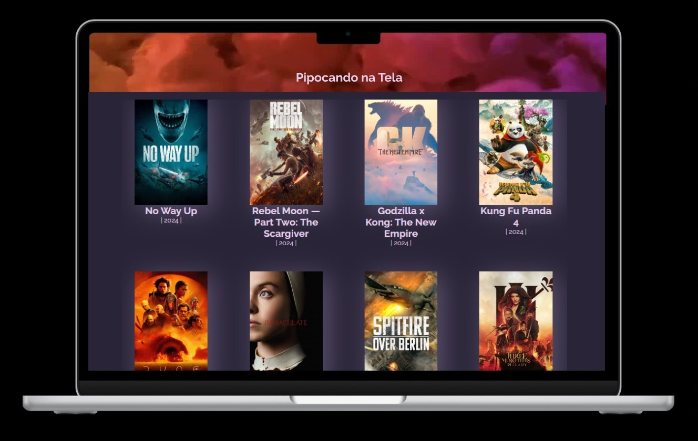

# Pipocando na Tela - Movie Challenge

## Descrição do Projeto

 

O "Pipocando na Tela - Movie Challenge" é um projeto de interface web para visualização e detalhamento de filmes. Ele utiliza a API do TMDB (The Movie Database) para buscar informações sobre filmes populares e exibir em uma interface amigável.

## Estrutura do Projeto

O projeto consiste em vários componentes JavaScript que são renderizados na página HTML principal. Aqui está uma visão geral da estrutura do projeto:

- **index.html**: Arquivo principal da aplicação web que contém a estrutura básica do HTML.
- **style.css**: Arquivo de estilo CSS que controla a aparência da aplicação.
- **main.js**: Arquivo JavaScript principal que coordena a interação entre os componentes e a API do TMDB.
- **components/**:
  - **App.js**: Componente que exibe a lista de filmes populares.
  - **Resumo.js**: Componente que exibe os detalhes de um filme selecionado.
  - **API.js**: Módulo JavaScript que contém funções para interagir com a API do TMDB.

## Funcionalidades Principais

1. **Visualização de Filmes Populares**: A página inicial exibe uma lista dos filmes mais populares atualmente. Cada filme é representado por uma imagem da capa do filme, título e ano de lançamento. Isso permite aos usuários visualizar rapidamente quais são os filmes em destaque.

2. **Detalhes do Filme**: Ao clicar em um filme na lista, os usuários são redirecionados para uma página de detalhes do filme. Nesta página, eles podem encontrar informações mais detalhadas sobre o filme, como sinopse, data de lançamento e outras informações relevantes.

3. **Navegação Simples**: A aplicação possui uma navegação simples que permite aos usuários alternar entre a lista de filmes populares e os detalhes de um filme específico. Isso proporciona uma experiência de usuário fluida e intuitiva.

4. **Integração com API do TMDB**: O projeto utiliza a API do TMDB para obter informações atualizadas sobre os filmes, garantindo que os dados exibidos na aplicação sejam sempre precisos e relevantes.

5. **Responsividade**: A aplicação é responsiva, o que significa que ela se adapta automaticamente a diferentes tamanhos de tela e dispositivos, proporcionando uma experiência consistente aos usuários, independentemente do dispositivo que estão usando.

Essas funcionalidades combinadas criam uma experiência envolvente para os usuários, permitindo que eles descubram novos filmes populares e aprofundem-se nos detalhes de seus filmes favoritos.

## Tecnologias Utilizadas

- HTML5
- CSS3
- JavaScript (ES6+)
- Node

## Planejamento e Protótipos

Para o Movie Challenge foi necessário criar uma SPA (*Single Page Applications*) para consumir uma API(*Application Programming Interface*).
No início deste projeto precisei compreender a lógica da componentização e funcionalidades para  coordenar as tarefas.

Busquei orientação com mentoras e colegas, e me apresentaram o UML (*Unified Modeling Language*).

Dediquei um tempo para fazer um fluxograma detalhado do meu projeto, e organizei a distribuição e gerenciamento de tempo e tarefas necessárias na contrução e entrega das soluções.

Seguindo esses passos consegui desbloquear fluxo do projeto, melhorei minha estratégia de aprendizado e consegui auxiliar outras colegas no percurso.

### - Mindmeister

**Ferramenta de mapas mentais e fluxogramas.**
No início deste projeto precisei compreender a lógica da componentização e funcionalidades para  coordenar todas as tarefas. Dediquei um tempo para fazer um fluxograma detalhado do projeto.

[Link para o fluxograma do projeto](https://mm.tt/app/map/3240232429?t=hQB7VKVnDd)

### - Todoist

**Plataforma para organizar e acompanhar tarefas.**

### - Figma

**Plataforma online de criação de interfaces, wireframes e protótipos.**

Protótipos de baixa fidelidade:

Protótipos de alta fidelidade:

#### Contribuindo

São bem-vindas contribuições neste projeto. Sinta-se à vontade para abrir uma issue ou enviar um pull request.
